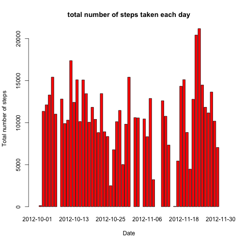

# Reproducible Research: Peer Assessment 1


## Loading and preprocessing the data

```r
data <- read.csv(unz("./activity.zip", "activity.csv"), header=TRUE, sep=",", na.strings = "NA")
```


## What is mean total number of steps taken per day?
+ Make a histogram of the total number of steps taken each day

```r
plot1data <- tapply(data$steps, list(data$date), sum)
barplot(plot1data, beside=TRUE, main="total number of steps taken each day", col="red",ylab="Total number of steps", xlab="Date")
```

 

+ Calculate and report the **mean** and **median** total number of steps taken per day


```r
dailymean<-formatC(mean(plot1data, na.rm=TRUE), format="f")
dailymedian<-formatC(median(plot1data, na.rm=TRUE), format="f")
```
The mean is 10766.1887 and median is 10765.0000


## What is the average daily activity pattern?
+ Make a time series plot (i.e. type = "l") of the 5-minute interval (x-axis) and the average number of steps taken, averaged across all days (y-axis)


```r
library("ggplot2")
averages <- aggregate(x = list(steps = data$steps), by = list(interval = data$interval), FUN = mean, na.rm = TRUE)
ggplot(data = averages, aes(x = interval, y = steps)) + geom_line() + xlab("5-minute interval") + ylab("Average number of steps taken")
```

 

+ Which 5-minute interval, on average across all the days in the dataset, contains the maximum number of steps?


```r
maxavg<-which.max(averages$steps)
averages[maxavg,]
```

```
##     interval steps
## 104      835 206.2
```


## Imputing missing values
+ Calculate and report the total number of missing values in the dataset (i.e. the total number of rows with NAs)


```r
sumna <- sum(is.na(data$steps)) 
```

Total number of NA is 2304

+ Devise a strategy for filling in all of the missing values in the dataset. The strategy does not need to be sophisticated. For example, you could use the mean/median for that day, or the mean for that 5-minute interval, etc.


```r
# Replace missing value with the mean value of its 5-minute interval
fillmean <- function(steps, interval) {
  filled <- NA
  if (!is.na(steps))
    filled <- c(steps)
  else
    filled <- (averages[averages$interval==interval, "steps"])
  return(filled)
}
```

+ Create a new dataset that is equal to the original dataset but with the missing data filled in.

```r
filled.data <- data
filled.data$steps <- mapply(fillmean, filled.data$steps, filled.data$interval)
```

+ Make a histogram of the total number of steps taken each day and Calculate and report the mean and median total number of steps taken per day. Do these values differ from the estimates from the first part of the assignment? What is the impact of imputing missing data on the estimates of the total daily number of steps?

```r
plot2data <- tapply(filled.data$steps, list(filled.data$date), sum)
barplot(plot2data, beside=TRUE, main="total number of steps taken each day", col="red",ylab="Total number of steps", xlab="Date")
```

 


```r
new.dailymean<-formatC(mean(plot2data), format="f")
new.dailymedian<-formatC(median(plot2data), format="f")
```
The mean is 10766.1887 and median is 10766.1887

## Are there differences in activity patterns between weekdays and weekends?
+ Create a bew factor variable in the dataset with two levels - "weekday" and "weekend" indicating weatgher a given date is a weekday or weekend day.


```r
# fill.weekend.weekday take a date and return a string of "weekend" or "weekday"
fill.weekend.weekday <- function(date) {
  day <- weekdays(date)
  if (day %in% c("Monday", "Tuesday", "Wednesday", "Thursday", "Friday")) 
    return("weekday") 
  else if (day %in% c("Saturday", "Sunday")) 
    return("weekend") 
  else 
    stop("invalid date")
}
```

Apply it to the data


```r
filled.data$date <- as.Date(filled.data$date)
filled.data$day <- sapply(filled.data$date, FUN = fill.weekend.weekday)
```

+ Make a panel plot containing a time series plot (i.e. type = "l") of the 5-minute interval (x-axis) and the average number of steps taken, averaged across all weekday days or weekend days (y-axis). The plot should look something like the following, which was creating using simulated data:


```r
dailyaverages <- aggregate(steps ~ interval + day, data=filled.data, mean)
ggplot(dailyaverages, aes(interval, steps)) + geom_line(colour="sky blue") + facet_grid(day ~ .) + xlab("5-minute interval") + ylab("Average number of steps taken")
```

 

